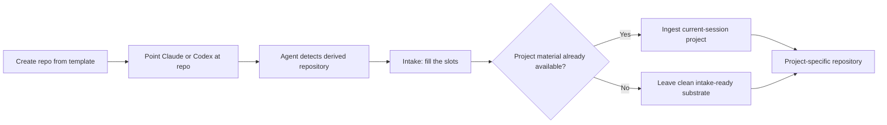

# AI-repo-template

[](https://scorecard.dev/viewer/?uri=github.com/Daniel-T-S-Adams/AI-repo-template)
[](https://github.com/Daniel-T-S-Adams/AI-repo-template/actions/workflows/ci.yml)
[](LICENSE)

> A secure, agent-native GitHub repository template for Claude Code and Codex. The primary downstream workflow is: create the repository, point an agent that already understands the project at it, and let the agent normalize the template before materializing the real project.

> [!IMPORTANT]
> **Agent inside a repository created from this template?** If the repository is **not** `Daniel-T-S-Adams/AI-repo-template`, do not treat this README, template examples, optional workflows, or generic documentation as project requirements. Read `CLAUDE.md` or `AGENTS.md` first and execute [Intake](docs/INTAKE.md). No command or setup interview is required.

## The Golden Path

`AI-repo-template` is optimized for a repository that has **already been created** from the GitHub template and is then entered cold by an engineering agent.



The agent should not make you explain the template, repeat project information it already has, or choose a stack merely because the repository is empty.

### What the intake does

Before application work, the first agent:

1. establishes the project from the current session, an initial plan, or the repository — never by guessing;
2. files that plan into its homes: `docs/spec/` for what is true, `docs/adr/` for why, `docs/checklist.md` for what gates progress, and the first slice's plan for what comes next;
3. fills the ten slots that vary between projects — document ownership, domain invariants, merge severities, the reviewers, the check command, deterministic feedback, human-only actions, how a PR lands, the unit of work, and who reads what landed;
4. decides the small, enumerated set of contents the template declares optional;
5. applies the settings GitHub does not copy into a new repository — hooks, branch protection, labels;
6. proves the check command fails when something is broken, rather than assuming it would.

Everything else is machinery and stays. Unfilled `«slot:»` markers in `CLAUDE.md` are how an agent knows the intake has not run.

See [docs/INTAKE.md](docs/INTAKE.md) for the canonical procedure.

## Create a Repository

Use GitHub's **Use this template** button, or create one from the CLI if that is how you are already working:

```bash
gh repo create my-project --template Daniel-T-S-Adams/AI-repo-template --private --clone
```

After creation, the recommended interaction is simply:

> Organize and publish the project we have been working on to `owner/repo`.

A correctly configured Claude Code or Codex session should recognize the derived repository and handle the intake automatically.

## Agent Support

This template intentionally supports two agent surfaces deeply:

| Agent | Entry point | Behavior |
|---|---|---|
| Claude Code | `CLAUDE.md` | Detects source-template vs. derived-repo mode; derived repos run the intake automatically |
| Codex | `AGENTS.md` | Same bootstrap contract using the open `AGENTS.md` convention |

Claude Code also receives `.claude/` commands, skills, hooks, and agents. `/project:bootstrap` is an explicit fallback; normal derived-repo entry does not require the user to invoke it.

## Design Principles

- **Agent-first, not wizard-first.** Infer from repository state, current session context, and existing artifacts before asking questions.
- **Remove assumptions before adding implementation.** No fake architecture, commands, environment variables, dependencies, or deployment targets.
- **Security survives cleanup.** Template normalization must not casually remove secret protection, safe ignore rules, AI security boundaries, or other proven safeguards.
- **Truthful configuration only.** A configuration that appears active but is not actually configured is worse than no configuration.
- **Minimal interruption.** Ask only when a material decision is genuinely unknowable or unsafe to infer.
- **Repository as durable context.** After intake, project-specific docs and agent instructions replace transient session knowledge.
- **Claude Code + Codex only.** Depth over broad, shallow agent compatibility.

## What Ships

The source template includes a broad security and governance toolkit so the intake can retain the parts appropriate to the incoming project:

- secret-aware `.gitignore`, `.gitattributes`, and `.editorconfig`;
- Claude Code and Codex instruction surfaces;
- pre-commit secret scanning and GitHub hardening scripts;
- issue/PR governance and CODEOWNERS;
- security documentation and prompt-injection defenses;
- **20 workflows** in the source template, including security, release, maintenance, and validation capabilities;
- Claude commands, skills, hooks, and an example agent;
- compliance and self-test tooling.

Not all of these belong in every derived project. **The intake decides what survives.**

## Source Template Development

If you are working on `Daniel-T-S-Adams/AI-repo-template` itself, do **not** run destructive downstream normalization. Follow `CLAUDE.md` / `AGENTS.md` in source-template mode.

Useful validation commands:

```bash
bash scripts/test-template.sh --local-only
bash scripts/test-e2e.sh
bash scripts/audit-compliance.sh --local-only
```

Repository security hardening is audited with:

```bash
bash scripts/secure-repo.sh --audit
```

## Documentation

| Document | Purpose |
|---|---|
| [Intake](docs/INTAKE.md) | Canonical first-agent normalization and project-intake SOP |
| [Getting Started](docs/GETTING-STARTED.md) | Short agent-first usage guide |
| [AI Security](docs/AI-SECURITY.md) | Agent threat model and security boundaries |
| [Branch Protection](docs/BRANCH-PROTECTION.md) | Repository hardening and rulesets |
| [Documentation Guide](docs/DOCUMENTATION-GUIDE.md) | Documentation quality standard |
| [Architecture](docs/ARCHITECTURE.md) | Architecture of the template project itself |
| [ADRs](docs/adr/) | Material design decisions |

The full index is in [docs/README.md](docs/README.md).

## Security

Never commit secrets. Derived repositories should retain the template's security baseline unless the intake can show that a control is irrelevant or has been replaced by an equivalent or stronger project-specific control.

See [SECURITY.md](SECURITY.md) and [docs/AI-SECURITY.md](docs/AI-SECURITY.md).

## License

`AI-repo-template` itself is MIT licensed. A downstream project's license is a separate decision. Do not assume the application's licensing merely because the template uses MIT; preserve any notices required for template material that remains in the derived repository.
