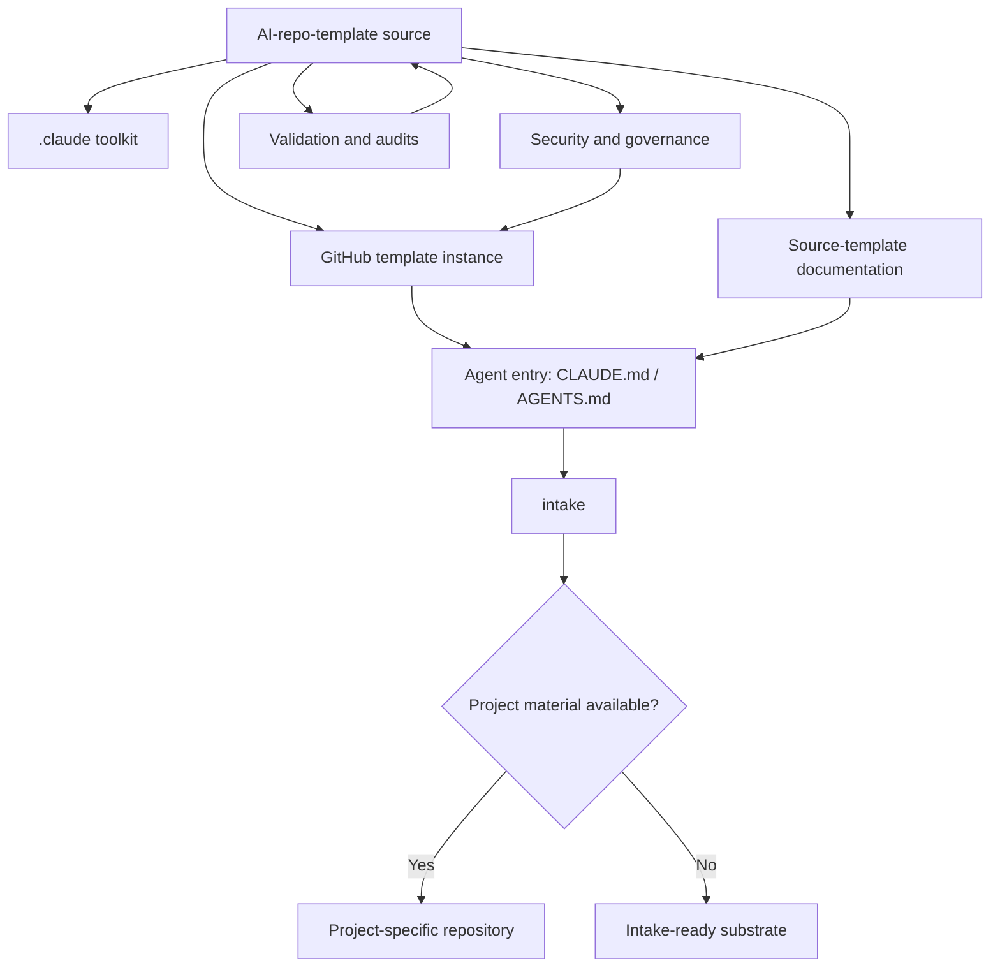
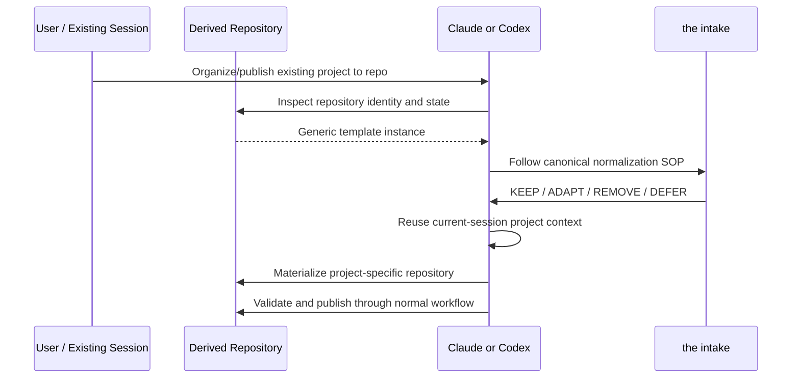

# Architecture

> Architecture of the `Daniel-T-S-Adams/AI-repo-template` source project. In a template-derived repository, the intake treats this as source-template reference material and reconciles it against the real incoming project.

**Last Updated:** 2026-08-13

## System Purpose

`AI-repo-template` is an agent-native repository substrate, not an application framework. It provides a secure GitHub baseline, Claude Code/Codex entry instructions, first-agent normalization, optional automation, and verification tooling.

## Architecture

## Components

| Component | Purpose | Primary locations |
|---|---|---|
| Agent entry | Distinguish source-template and derived-repository behavior | `CLAUDE.md`, `AGENTS.md` |
| Intake | Fill the project-specific slots the template leaves blank | `docs/INTAKE.md` |
| Claude toolkit | Commands, skills, hooks, and specialized agents | `.claude/` |
| GitHub governance | PR/issue policy, CODEOWNERS, dependency and workflow configuration | `.github/` |
| Security baseline | Secret protection, repository hardening, AI threat model | `templates/hooks/`, `scripts/secure-repo.sh`, `docs/AI-SECURITY.md` |
| Verification | Template regression, E2E, compliance, and CI checks | `scripts/test-template.sh`, `scripts/test-e2e.sh`, `scripts/audit-compliance.sh`, `.github/workflows/` |
| Documentation | Source-template operation, security, architecture, and decisions | `README.md`, `docs/`, `docs/adr/` |

## Derived-Repository Flow

## Design Constraints

- **GitHub template copying is whole-repository copying.** Source-template files are inherited by derived repositories; agent entry behavior must distinguish reference material from project requirements.
- **No application stack assumption.** The substrate must remain valid before a runtime/framework is known.
- **Security before convenience.** Normalization may simplify tooling but must not casually weaken proven safeguards.
- **Two-agent focus.** Claude Code is primary and Codex is supported through `AGENTS.md`.
- **Truth over placeholders.** Root agent/documentation surfaces must describe the template project itself rather than fictitious example systems.
- **No mandatory lifecycle engine.** Repository identity plus project-specific replacement of generic entry files is sufficient for the current the intake transition.

## Decision Records

Material architecture decisions are recorded in [docs/adr/](adr/).

| ADR | Decision |
|---|---|
| [001](adr/001-sha-pinned-actions.md) | SHA-pin GitHub Actions |
| [002](adr/002-rulesets-over-classic-protection.md) | Prefer rulesets over classic branch protection |
| [003](adr/003-skills-directory-format.md) | Use runtime-supported skill directory format |
| [004](adr/004-two-agent-focus.md) | Focus on Claude Code + Codex |
| [005](adr/005-drift-severity-and-fail-closed.md) | Severity-aware, fail-closed drift verification |
| [006](adr/006-agent-native-phase-zero.md) | Agent-native Phase 0 for derived repositories — *superseded by 008* |
| [007](adr/007-template-upgrade-reconciliation.md) | Semantic reconciliation for downstream template upgrades |
| [008](adr/008-slot-based-intake.md) | Slot-based intake supersedes Phase 0 |
| [009](adr/009-no-post-merge-digest.md) | No post-merge digest; nobody reads merges by decision |

---

**Referenced by:** [README.md](../README.md), [CLAUDE.md](../CLAUDE.md), [AGENTS.md](../AGENTS.md)  
**See also:** [Intake](INTAKE.md) | [AI Security](AI-SECURITY.md) | [ADRs](adr/)
